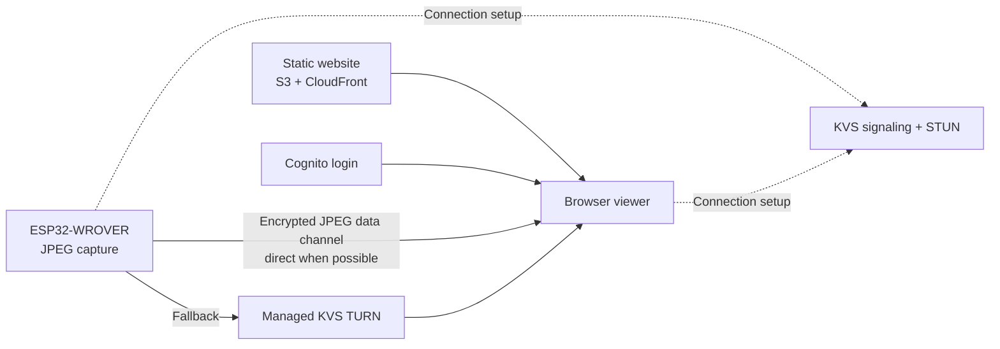

# JPEG over WebRTC for the garage camera

Research date: 14 September 2026.

## Implementation checkpoint — 15 September 2026

**The local hardware gate failed. The original camera firmware has been restored
and its full-flash digest verified. AWS deployment is gated and was not started.**

Implemented the native ESP-IDF firmware, versioned JPEG data-channel transport,
USB signaling bridge, TypeScript/Vite lab viewer, seven transport regression
tests, and build/backup/flash/recovery tooling. See
`firmware/camera_webrtc/README.md` for commands and the wire interface.

The approved implementation target superseded the research's initial VGA
suggestion: retain 1600×1200, require at least 2 decoded fps, aim for 5 fps, and
eventually validate physical iPhone Safari plus desktop Chrome.

### Measured local result

The final candidate used ESP-IDF 5.5.5, esp_peer 1.5.5, esp32-camera 2.1.7,
two PSRAM frame buffers, 80 MHz PSRAM, JPEG quality 12, a 20 MHz camera clock,
a separate receive task and a 2 Mbps JPEG payload cap.

| Measurement | Result |
| --- | ---: |
| Resolution decoded and displayed | 1600×1200 |
| Requested frame rate | 5 fps |
| Initial short sample | Approximately 2.72 decoded fps |
| Completed formal measurement window | 317 seconds; session disconnected before 600 seconds |
| Decoded frames within that window | 577 |
| Formal-window frame rate | **1.82 fps — failed** |
| Total valid decoded frames in the session | 701 |
| Browser JPEG decode errors / malformed chunks | 0 / 0 |
| Incomplete frames at gate completion | 104 |
| Final rolling estimated p95 display latency | 1.83 seconds |
| Device minimum internal heap | 118,196 bytes |
| Wi-Fi RSSI observed during the session | −67 to −81 dBm |

The viewer was still visible when the peer disconnected; this was not the
intentional page-background stop behavior. No device reboot or allocation failure
was observed during this session. Twenty-cycle, remote/TURN, one-hour renewal and
physical iPhone tests were not reached.

### What the failure establishes

Encrypted 2 MP JPEG delivery and browser reconstruction work in a short local
session. The sustained-rate and connection-stability requirements have not been
met, so the full private-viewer implementation remains incomplete.

Time accumulated inside `esp_peer_send_data` was approximately 326 seconds,
versus 1.94 seconds in camera-frame acquisition calls. Send-call time includes
encryption, network waits and library backpressure; this is not a CPU-only
benchmark. The measurements concentrate the investigation on the send path.

The session negotiated `TLS-ECDHE-ECDSA-WITH-AES-256-CBC-SHA`. Near the disconnect,
the peer library logged `mbedtls_ssl_read error: -26752`, corresponding to
`MBEDTLS_ERR_SSL_WANT_WRITE` (`-0x6880`). That status is a retry condition; the
upstream read wrapper explicitly handles WANT_READ/TIMEOUT but logs WANT_WRITE as
an error. Its contribution to the disconnect has not been isolated.

Wi-Fi signal also weakened, and the restored HTTP firmware delivered slowly in
its short recovery check. The current evidence does not separate radio conditions
from DTLS/SCTP behavior or establish an immutable board throughput limit.

If another experiment is requested, first obtain a repeatable stronger-signal
baseline, explicitly compare AES-GCM/ChaCha20-Poly1305 with the negotiated CBC
mode, inspect WANT_WRITE/backpressure handling, and compare smaller data-channel
messages. Re-run the entire local gate before creating AWS resources.

### Recovery and evidence

- The initial backup read at 460800 baud failed with serial noise. A complete
  115200-baud read succeeded.
- An application reboot changed NVS before the first verification. Bootloader
  and remaining flash regions still matched. NVS was reread with the application
  stopped, and the resulting entire 4 MiB snapshot matched the device's MD5.
- The complete snapshot was restored at 460800 baud. Verification before the
  application booted matched the full-flash digest.
- The recovery check decoded 11 valid 1600×1200 JPEGs, confirmed the original
  32 KiB TCP send buffer, left image settings unchanged and released the stream.
- No AWS resources or Cognito user were created. The supplied viewer email has
  not been placed in tracked source.

Experimental image SHA-256:
`1031607c9fb650065d9a70acf05785a0d9851770d83ac34227030b4d1e30e40c`.

Recovery image SHA-256:
`1735cdf6e2b0d8062cb82da49cc0655bd709b3a96ee74134399fad4c80675f31`.

Local ignored evidence:

- `output/playwright/local-gate-report.json`
- `output/playwright/local-webrtc.png`
- `output/playwright/restored-camera-check.json`
- `.arduino-build/webrtc-lab-serial.log` (SDP redacted)
- `.arduino-build/camera-webrtc/manifest.json`
- `.arduino-build/webrtc-restore.log`
- `.arduino-build/webrtc-backups/pre-webrtc-20260915-verified.bin`

## Recommendation and confidence

Build a small prototype using the existing ESP32-WROVER camera driver, Espressif's
`esp_peer` library, and Kinesis Video Streams (KVS) WebRTC signaling/STUN/TURN.
Send the sensor's JPEG frames as binary data-channel messages and display them
with a custom browser viewer. This architecture needs no continuously running
proxy instance and no H.264 encoder.

The protocol and available source code motivated the local prototype above.
The combined AWS application remains unbuilt and untested. The local prototype
failed its first sustained acceptance gate; remote reconnect behavior and Safari
compatibility remain unverified. The following sections retain the architecture
research and proposed later stages.

This is a proposal for live viewing. It does not supply KVS HLS playback,
recording, a DVR timeline, or automatic video analysis.

## Evidence inspected

Espressif repository revision:
`c8650846b512e6e1375e5f78c1c41619b8d645eb`, dated 8 September 2026.
The component manifest at this revision identifies `esp_peer` as version 1.5.5.

| Evidence | What it establishes | Important boundary |
| --- | --- | --- |
| `components/esp_peer/libs/esp32/libpeer_default.a` and its CMake integration | A peer library is supplied for the original ESP32 target | Library availability does not establish application memory or performance |
| `components/esp_peer/README.md` | ICE, TURN, DTLS, SCTP and configurable data channels are supported | The small minimum-memory example is not a camera-plus-AWS memory budget |
| `solutions/local_jpeg_stream` | An official example sends sensor JPEG through a chunked data channel to browser JavaScript | Its listed example boards are S3/S31/P4; signaling is local HTTPS |
| `solutions/kvs_master` | An official adapter joins AWS signaling as MASTER and answers browser VIEWER offers | The example uses newer hardware and an H.264/audio media configuration |
| `sepfy/pear-esp32-examples` | An older project specifically demonstrates JPEG data channels on ESP32-EYE | It is being folded into libpeer; use as evidence, not the preferred new dependency |

These are complementary building blocks, not an already verified WROVER/KVS/JPEG
application. Prefer the current Espressif peer library while reusing our existing
`esp_camera_fb_get()` capture path. Avoid importing the complete audio, display,
board-manager and bidirectional-video demo stack unnecessarily.

The new MJPEG-over-RTP feature in the peer changelog is explicitly described as
unsupported by browsers. Use **SCTP data channels** for this website.

## Proposed architecture

The camera remains available through a lightweight signaling connection. It sends
JPEGs only during an authenticated viewing session. ICE selects a working direct
or relayed route. TURN must remain available for networks where direct
connectivity fails; the proportion of relayed sessions cannot be predicted from
the source code.

The browser reassembles complete JPEG frames and displays them as images or on a
canvas. It does not need a native JPEG WebRTC video track or access to the
viewer's camera/microphone. KVS supplies signaling and NAT traversal; it does not
interpret the JPEG payloads in this design. Do not enable WebRTC ingestion/storage.

## Firmware and browser work

1. Create a minimal peer with audio and native video tracks disabled and a binary
   data channel enabled. Keep the existing camera pins and sensor JPEG format.
2. Implement KVS MASTER signaling. The browser acts as VIEWER and creates the
   offer/data channel. Preserve the answerer role across reconnections.
3. Fragment frames into modest messages; the current Espressif JPEG demo uses
   10,000-byte payloads. Add explicit frame IDs, chunk indices and total length,
   plus strict receiver size limits and expiry for incomplete frames.
4. Use a channel configured for unordered delivery and limited retransmission.
   Keep a bounded send queue and discard stale frames under congestion. The
   demo's simple chunk sequence is a useful starting point, but robust handling
   of loss/reordering should not be assumed from it.
5. Expose received FPS, byte rate, dropped frames, heap minimum and the selected
   ICE candidate type. Display whether the session is direct or relayed.
6. Make hangup, network loss and browser closure release all camera/peer resources.
   Stream controls should change frame rate, resolution and JPEG compression.

The checked Arduino 3.3.11 ESP32 SDK already enables DTLS. However, its installed
configuration does not define `CONFIG_MBEDTLS_SSL_DTLS_SRTP`, which the upstream
peer component requires and calls, and allocates mbedTLS memory internally.
Consequently, simply adding an Arduino library should not be assumed sufficient.
An ESP-IDF build, possibly with Arduino as a component, provides control over
crypto configuration, PSRAM allocation and the partition table. A focused build
spike should settle the least disruptive integration path.

The existing firmware uses about 81% of the default app partition, so verify the
new link-map and flash layout. Do not infer linked firmware size from the size of
the prebuilt archive.

## Limits that affect this camera

- AWS documents a hard **5 Mbps** TURN-session limit. Stay comfortably below it
  when selecting a mode that must work through relay.
- The repository's existing stability record is 13.37 fps at 53.6 KiB/JPEG,
  approximately **5.87 Mbps of JPEG payload alone**. This cannot be promised
  through KVS TURN at the same settings. That record is a previous measurement,
  not a new measurement made during this research.
- An earlier VGA measurement averaged 9.2 KiB/JPEG. At the same frame size,
  5–10 fps would be about 0.38–0.75 Mbps before protocol overhead. This is an
  illustrative calculation; scene and compression change JPEG size.
- The board has 4 MiB PSRAM, but its previous streaming test recorded only
  68,756 bytes of free internal heap in one active sample. TLS, SCTP, Wi-Fi,
  camera DMA and task stacks must be profiled together.
- KVS TURN credentials have a five-minute lifecycle; fetch fresh credentials for
  new allocations. This is not a five-minute video-session limit.
- KVS signaling connections have a one-hour maximum duration and an idle timeout.
  Implement keepalive/reconnection and refresh signed URLs/credentials.
- Test Safari/iPhone explicitly. The local JPEG demo documents Chrome/Edge and
  local-network workarounds, which are not evidence of a polished remote viewer.

The existing TCP-send-buffer optimization improves the current HTTP stream; it
does not establish the performance of a WebRTC data channel.

## Authentication and sample-code adaptations

Use Cognito user-pool login with a narrowly scoped authenticated identity-pool
role for the browser. Authorize viewing the specific signaling channel and
disable anonymous camera access. A private application does not require hiding
its static JavaScript; access to camera signaling and credentials must be enforced.

For the camera, AWS's smart-camera guidance uses an X.509 device certificate and
the AWS IoT credentials provider to obtain temporary, limited-permission AWS
credentials. Apply that pattern to the channel's MASTER permissions. This can
avoid introducing a separate always-on authentication server.

The inspected KVS demo is a starting point:

- It exposes compile-time AWS credential settings; add a renewable device
  credential provider.
- Its ICE-response parser selects only the first server URI and does not parse
  the returned TTL; use the suitable UDP/TCP/TLS candidates and refresh policy.
- Its logging includes TURN credentials and the signed signaling URL; remove
  those log outputs.
- Its initial setup signs the WebSocket URL once; handle expiry during idle
  periods and reconnects.

Provisioning and these adaptations remain implementation work. The 14 September
research was read-only; the 15 September firmware experiment and restoration are
recorded above.

## Estimated ongoing AWS cost

Sydney (`ap-southeast-2`), USD before tax. Rates were read from the public AWS price
list on the research date:

| Meter | Rate |
| --- | ---: |
| Active KVS signaling channel | $0.0473/month |
| Signaling messages | $3.547/million |
| TURN relay minutes | $0.1892/1,000 minutes |
| Internet egress after the shared free allowance, first paid tier | $0.114/GB |

The following calculations use 30 days, one session/day with 30 signaling
messages, one billable relay stream, and no storage:

| Viewing time | Direct sessions: signaling only | All sessions relayed: signaling + TURN |
| --- | ---: | ---: |
| 10 min/day | $0.0505/month | $0.1073/month |
| 30 min/day | $0.0505/month | $0.2208/month |
| 60 min/day | $0.0505/month | $0.3911/month |

TURN is metered in one-minute increments. Multiple sessions/allocations or extra
signaling change the charges. A second billed relay allocation would increase
the TURN portion; confirm actual usage meters during the pilot.

At 2 Mbps and 30 min/day, one relayed video stream sends about 12.57 GiB/month.
That is within AWS's shared 100 GB/month outbound free allowance if it remains
available. If the account has exhausted that allowance, add approximately $1.43
for that amount of video, plus protocol overhead. Direct sessions do not send
their JPEG payload through AWS.

CloudFront's free plan can host a tiny static frontend, and Cognito
Lite/Essentials direct sign-ins have a 10,000-MAU free allowance. Identity-pool
authentication is free. S3 requests, credential/control calls, verification
emails and logging can add small charges. Allow roughly $0–1/month for these at
household scale as a planning allowance, not a guaranteed fixed bundle. The
account's other usage and free allowances have not been inspected.

The design can plausibly run below $1/month for light use with allowances
available; **$1–2/month is a reasonable initial budget**, subject to the pilot.
Domain registration, tax, electricity and the existing Bedrock monitor are
outside these estimates. No H.264 ingestion or WebRTC-recording charge is
included because neither is part of the proposal.

## Suggested prototype and decision points

1. **Build feasibility:** compile a minimal original-ESP32 peer, check TLS/SRTP
   integration and flash/RAM use. Retain a recoverable copy of current firmware.
2. **Local JPEG data channel:** stream 640×480 at 5 fps to a simple browser
   viewer; measure decoded frames, heap, latency and loss behavior.
3. **Remote connectivity:** add KVS signaling and test home Wi-Fi to mobile data.
   Record the chosen ICE route, then force TURN to establish relay compatibility.
4. **Stability:** test repeated sessions, idle periods longer than five minutes,
   signaling reconnection after an hour, deliberate Wi-Fi loss, and browser
   closure. Exercise a slow viewer to verify bounded buffering.
5. **Private website:** integrate renewable device credentials and Cognito login,
   test unauthenticated denial, then validate Safari/iPhone.
6. **Quality tuning:** increase frame rate/resolution within measured CPU,
   memory, upload and relay limits; measure billed relay/egress use.

A successful local data channel alone is not proof of remote viability. A
successful direct remote session alone is not proof of TURN compatibility.
Preserving 1600×1200 at roughly 13 fps is an optimization goal, not the initial
acceptance criterion.

## Source addresses

Source code paths above are relative to the pinned Espressif repository revision.

- Espressif repository: `https://github.com/espressif/esp-webrtc-solution`
- JPEG demo: `https://github.com/espressif/esp-webrtc-solution/tree/c8650846b512e6e1375e5f78c1c41619b8d645eb/solutions/local_jpeg_stream`
- KVS demo: `https://github.com/espressif/esp-webrtc-solution/tree/c8650846b512e6e1375e5f78c1c41619b8d645eb/solutions/kvs_master`
- Peer component: `https://components.espressif.com/components/espressif/esp_peer/versions/1.5.5/readme`
- Original ESP32 JPEG example: `https://github.com/sepfy/pear-esp32-examples`
- AWS architecture: `https://docs.aws.amazon.com/solutions/deploying-smart-cameras-using-amazon-kinesis-video-streams-with-webrtc/`
- AWS WebRTC operation: `https://docs.aws.amazon.com/kinesisvideostreams-webrtc-dg/latest/devguide/kvswebrtc-how-it-works.html`
- AWS WebRTC quotas: `https://docs.aws.amazon.com/kinesisvideostreams-webrtc-dg/latest/devguide/kvswebrtc-limits.html`
- IoT credential provider: `https://docs.aws.amazon.com/kinesisvideostreams/latest/dg/how-iot.html`
- KVS pricing: `https://aws.amazon.com/kinesis/video-streams/pricing/`
- Sydney KVS price list: `https://pricing.us-east-1.amazonaws.com/offers/v1.0/aws/AmazonKinesisVideo/current/ap-southeast-2/index.json`
- Sydney transfer price list: `https://pricing.us-east-1.amazonaws.com/offers/v1.0/aws/AWSDataTransfer/current/ap-southeast-2/index.json`
- Shared internet-transfer allowance: `https://aws.amazon.com/ec2/pricing/on-demand/`
- Cognito pricing: `https://aws.amazon.com/cognito/pricing/`
- CloudFront pricing: `https://aws.amazon.com/cloudfront/pricing/`
- Local camera measurements: `firmware/camera_stream/VALIDATION.md`
